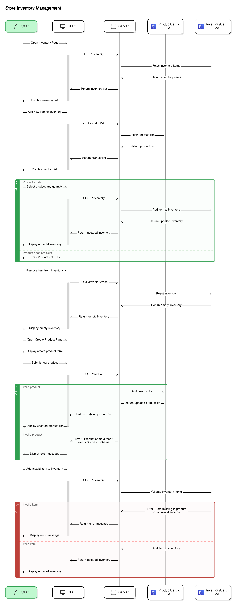

This is a [Next.js](https://nextjs.org/) project bootstrapped with [`create-next-app`](https://github.com/vercel/next.js/tree/canary/packages/create-next-app).

## Getting Started

First, run the development server:

```bash
npm run dev
# or
yarn dev
# or
pnpm dev
# or
bun dev
```

Open [http://localhost:3000](http://localhost:3000) with your browser to see the result.

1. Introduction
   The Store Inventory Management System is a web application designed to help store managers efficiently manage their product lists and inventory. This application will be built using React.js, Next.js with TypeScript and will interact with a designated server to handle API calls for managing products and inventory. The application includes two main pages: an inventory list and a product creation page.

2. Requirements
   Functional Requirements
   Inventory List Page:

    Display a list of inventory items.
    Allow users to add new inventory items by selecting from a list of available products.
    Allow users to remove inventory items.
    Each inventory item should have a name and a quantity.
    Product Creation Page:

    Allow users to create new products by specifying a name.
    API Endpoints:

    GET /product/all: Retrieve all products.
    PUT /product: Create a new product.
    GET /inventory: Retrieve the inventory list.
    POST /inventory: Update the inventory list.
    POST /inventory/reset: Reset the inventory list.

3. Modules
   Application:

    Inventory List Component: Handles displaying and managing the inventory.
    Product Creation Component: Handles the creation of new products.
    API Server:

    Product API:
    Endpoint to retrieve all products.
    Endpoint to create a new product.
    Inventory API:
    Endpoint to retrieve the inventory list.
    Endpoint to update the inventory list.
    Endpoint to reset the inventory list.

    Diagram 


